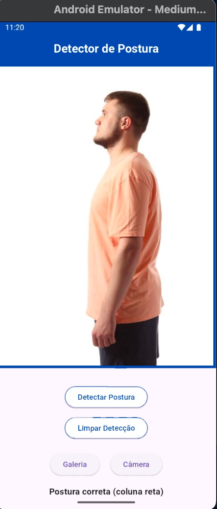

# Pose Detector

Este projeto é um **detector de poses** desenvolvido em **Flutter** para **Android**. 

## 🛠 Tecnologias utilizadas
- **Flutter**
- **Dart**
- **Android SDK**
- **ML Kit**

## 🔧 Como executar o projeto
1. Clone este repositório:
   ```sh
   git clone https://github.com/Igorggwp/posture_detector
   ```
2. Acesse o diretório do projeto:
   ```sh
   cd pose_detector
   ```
3. Instale as dependências:
   ```sh
   flutter pub get
   ```
4. Conecte um dispositivo Android ou inicie um emulador.
5. Execute o aplicativo:
   ```sh
   flutter run
   ```

   
